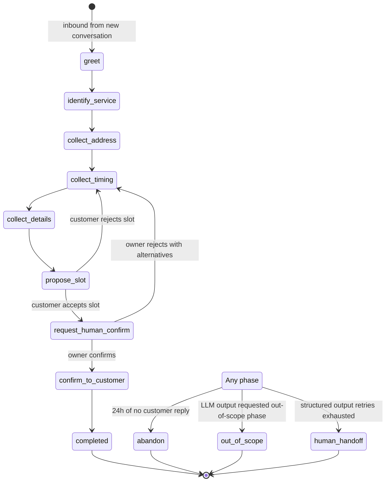

# Agent state machine

The agent is a state machine, not a free-running LLM. Each turn the LLM
chooses the next phase from a fixed enum and produces a reply text
appropriate to that phase. Arbitrary off-script chat is rejected with a
scope-bounded fallback. Property-based tests assert the invariants —
"completed is unreachable without propose_slot", "request_human_confirm
requires a held slot", and so on.

The current phase is derived from `messages.phase` of the most recent
message in a conversation; there is no `current_phase` column on
`conversations` and tests assert that. The derivation lives in one
place — `Conversation::currentPhase()` — and the FastAPI worker reads
it via `GET /_internal/conversations/{id}/turn-context`.

## Diagram



## Phases

### `greet`

Entered when an inbound message arrives on a conversation with no prior
messages from the agent, or when the prior conversation was terminal
(`completed`, `abandon`, `out_of_scope`, `human_handoff`) and the
customer is starting a new one.

Allowed next phases: `identify_service`, `out_of_scope`, `abandon`,
`human_handoff`.

Agent says something like: "Hi, this is the booking line for {business
name}. I can help with that. What's the service address?" The persona
modulates tone; the structure is fixed.

### `identify_service`

The customer's first message was ambiguous about the service type. The
agent asks. Skipped if the LLM can infer the service from the greet
turn.

Allowed next phases: `collect_address`, `out_of_scope`, `abandon`,
`human_handoff`.

### `collect_address`

The agent asks for the service address. The reply is run through
Google Geocoding and the service-area check; if out-of-area, the
transition is to `out_of_scope`.

Allowed next phases: `collect_timing`, `out_of_scope`, `abandon`,
`human_handoff`.

### `collect_timing`

The agent asks when the customer wants the service. The reply triggers
a slot search (business hours + lead time + quiet hours + Calendar
availability + Foyer hold/booking conflict).

Allowed next phases: `collect_details`, `propose_slot`, `out_of_scope`,
`abandon`, `human_handoff`.

### `collect_details`

If the service type requires a photo (`service_types[].requires_photos
= true`), the agent asks. MMS or web upload land here.

Allowed next phases: `propose_slot`, `abandon`, `human_handoff`.

### `propose_slot`

The agent proposes a specific slot. The DB hold is created in the same
transaction-shaped flow as the Calendar tentative event. If the
exclusion constraint rejects the insert (another conversation took
that slot first), the agent re-searches and proposes the next one.

Allowed next phases: `request_human_confirm` (customer accepts),
`collect_timing` (customer rejects, agent re-searches), `out_of_scope`,
`abandon`, `human_handoff`.

### `request_human_confirm`

The hold is live; the agent tells the customer to expect a confirmation
within fifteen minutes. The owner sees the pending card in Filament.
The agent does not auto-confirm — the only thing that advances this
phase is the owner clicking confirm or reject.

Allowed next phases: `confirm_to_customer` (owner confirms),
`collect_timing` (owner rejects with alternatives), `out_of_scope`
(owner rejects without alternatives — the agent texts an apology),
`abandon` (hold expires without owner action — the slot-cleanup job
expires the hold and texts the customer).

### `confirm_to_customer`

The owner has confirmed; the agent sends the confirmation SMS
(quiet-hours-respecting), the booking row transitions to `confirmed`,
the Calendar event is updated to its final title and transparency.
This phase is short — one turn, then `completed`.

Allowed next phases: `completed`.

### Terminal phases

- `completed` — the booking flow finished successfully.
- `abandon` — 24 hours with no customer reply, or hold expired without
  owner action. The conversation can be re-opened by a new inbound,
  which creates a new conversation row (does not reopen this one).
- `out_of_scope` — the request hit a scope guard (out-of-area,
  out-of-hours, service not offered, request unparseable). Logged to
  `out_of_scope_log` with the inferred reason.
- `human_handoff` — the agent gave up. The owner is notified via the
  configured `human_handoff_phone`. The conversation can be re-engaged
  manually from the Filament admin.

## Transition rules

The LLM's structured output includes a `next_phase` field. On the
Laravel side, the `turn-result` endpoint validates the transition
against an allowlist matrix. Disallowed transitions return
`409 phase-transition-invalid` and the worker treats it as terminal
(no retry; the agent is misconfigured).

The matrix:

```
greet                  → identify_service, out_of_scope, abandon, human_handoff
identify_service       → collect_address, out_of_scope, abandon, human_handoff
collect_address        → collect_timing, out_of_scope, abandon, human_handoff
collect_timing         → collect_details, propose_slot, out_of_scope, abandon, human_handoff
collect_details        → propose_slot, abandon, human_handoff
propose_slot           → request_human_confirm, collect_timing, out_of_scope, abandon, human_handoff
request_human_confirm  → confirm_to_customer, collect_timing, out_of_scope, abandon
confirm_to_customer    → completed
completed              → (terminal)
abandon                → (terminal)
out_of_scope           → (terminal)
human_handoff          → (terminal)
```

## Invariants

Tested with Hypothesis on the Python side, PHPUnit on the PHP side:

1. **`completed` is unreachable without first passing through
   `propose_slot`.** No path in the matrix lands at `completed` that
   skipped `propose_slot`.
2. **`request_human_confirm` is unreachable without a live slot hold.**
   Asserted in the transition handler; an attempt to transition without
   a hold returns `409`.
3. **No transition from a terminal phase.** Terminal phases reject all
   incoming transitions with `409`.
4. **Out-of-scope is reachable from every non-terminal phase.** The
   scope guard is universal.
5. **`abandon` is reachable from every non-terminal phase.** The 24-hour
   no-reply cleanup is universal.

## Why no `current_phase` column

A `current_phase` column on `conversations` is a tempting denormalization
but it doubles the source of truth for phase state. The derived rule —
phase is the `phase` of the last message — keeps message and phase in
lockstep by construction. A test asserts the rule on every conversation
in the fixture set; the cost of a query-per-derivation is bounded
because the agent worker fetches the recent message list anyway and the
admin uses an indexed `MAX(created_at)` lookup.

The right denormalization, if the cost becomes real, is a trigger that
maintains the column on every `messages` insert. That is still a
single-source-of-truth shape (the messages are the source; the column
is a cache). The wrong shape is a free-text column that callers update
manually.
